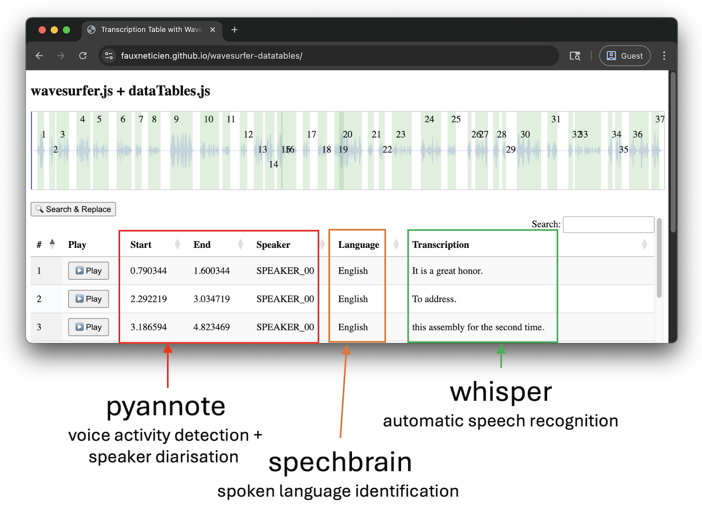
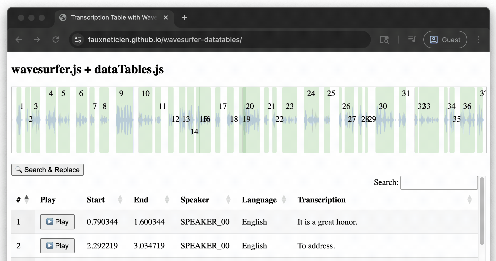
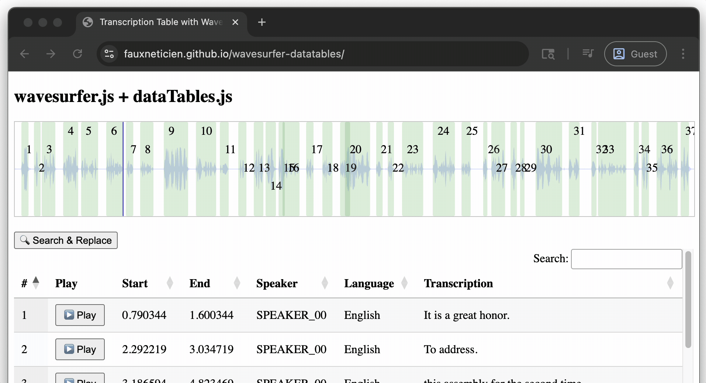
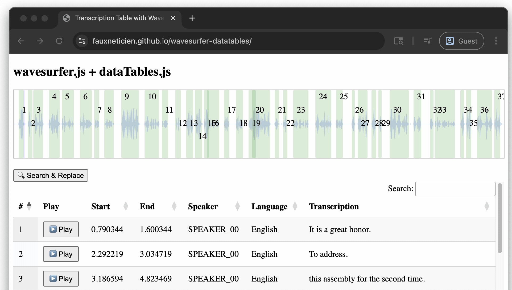
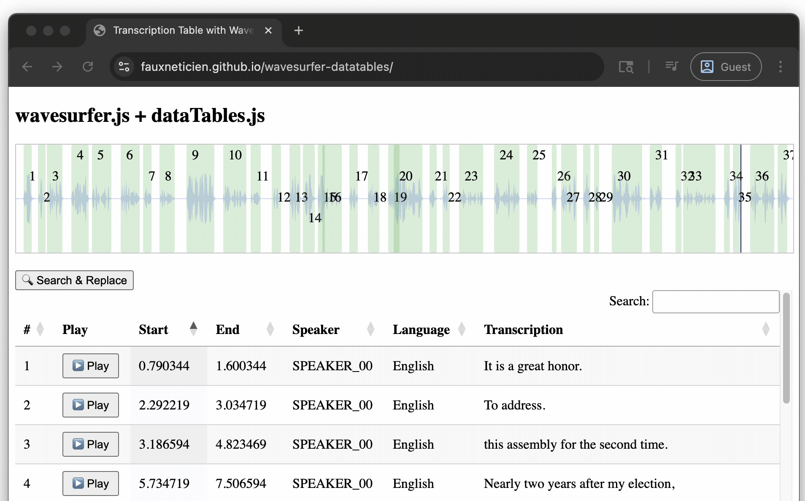

# wavesurfer + datatables

Proof of concept for quickly editing speech annotations: https://fauxneticien.github.io/wavesurfer-datatables/

## Problem

- Hand-annotating speech is time consuming. 

- Models can help annotate speech data for various information:
  - who was speaking when (voice activity detection + speaker diarisation)
  - in what language (spoken language identification), and
  - what was said (speech-to-text/automatic speech recognition)
 
- But hand-correcting model outputs when they are wrong can take even more time!
  - Especially bad segmentation: join multiple intervals into one phrase or split an interval

- How to quickly edit (or discard) select model-generated annotations before export to other software (e.g. Praat/ELAN)?

## Proof-of-concept interface

### What is this audio??

Openly available mp3 audio of (seperate) UN General Assembly addresses by Barack Obama and François Hollande, hand-spliced together by me for demo of multi-speaker, multi-language audio. So I can control various things like intentionally overlapping speech, etc. for interface development.

### Double-click regions or rows to play audio

(Reserving single-click for upcoming feature of selecting multiple regions/rows and merging into one).

### Filter/sort rows

Free via dataTables.js

### Bulk search and replace

Automatic diarisers won't know speaker identity. Allow bulk search-and-replace to modify model labels in a given column.

### TODO: Regions/rows merge

- Shift + Click multiple regions/rows
- Click merge (require regions/rows)
- Display modal with
  - Min of start time (not adjustable here)
  - Max of end time (not adjustable here)
  - Pre-filled values of various cell texts concatenated
- Merge updates both wavesurfer regions and datatable rows

### TODO: Regions/rows split

- Click waveform to place cursor
- Get active region and cursor time
- Display modal with:
  - Old region that will be deleted
  - Region 1: min of old region, max at cursor, copy of old region contents (?)
  - Region 2: min at cursor, max of old region, copy of old region contents (?)
- Once confirmed then:
   - Delete old region
   - Create 2 new regions
   - Merge updates both wavesurfer regions and datatable rows
